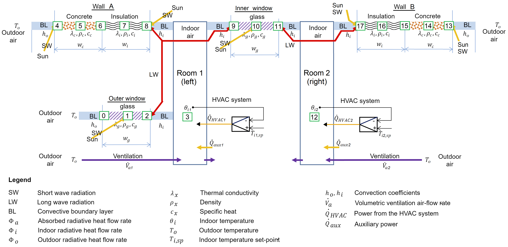
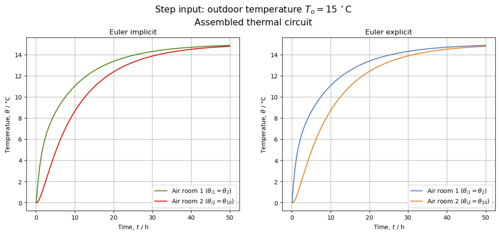

# Simulation of a Thermal Circuit with Python

| Author | Institution | Date |
|:---|:---|:---|
| Etienne Gubler | Zurich University of Applied Sciences | Sept. 2023 - Nov. 2023 |

## Project Details

- Module: DM4BEM (Dynamic Models for Building Energy Management)
- Student: Etienne Gubler (gubleet1)
- Submission date: November 28th 2023
- Project report (Jupyter Notebook): [00_Project_Etienne-Gubler.ipynb](./00_Project_Etienne-Gubler.ipynb)

### Executable Version

  
*(May take up to 10 min. to build and launch. Alternatively, a static version of the Jupyter Notebook is available [here](./00_Project_Etienne-Gubler.ipynb).)*

# Evaluating Thermal Circuit Simulations: Single Network vs. Composite Subnetworks

**Summary:**
- The heat transfer in **two connected rooms** is modeled using a thermal circuit.
- This **thermal circuit** is implemented **as a single network and** also **as** a combination of **multiple subnetworks**.
- Then the **mathematical model as a system of differential algebraic equations (DAE)** is obtained for both versions of the thermal circuit.
- The systems of DAE are transformed into **state-space representations** to allow the thermal circuits to be simulated.
- The **simulation** is then performed **using the Euler methods** (both explicit and implicit) for numerical integration.
- In the end, **the outcome of the two simulations is being compared**. This is done to **ensure, that the result of a simulation does not depend on the method** that is used to create the thermal circuit (using either a single or an assembled network).
- Both simulated thermal circuits model the same physical components and **should** therefore **lead to identical results**.

## Key Figures from the Report

> Figure 3. Heat processes for the two connected rooms.

> Figure 6. Step response to outdoor temperature by using Euler implicit and explicit integration of the assembled thermal circuit.

**Licence**

Code is released under [MIT Lincence](https://choosealicense.com/licenses/mit/).

