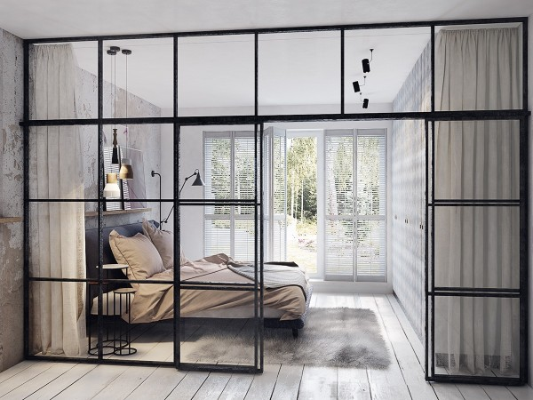

# Project report DM4BEM

- Student: Etienne Gubler (gubleet1)
- Date: November 28th 2023
- File: 00_Project_Etienne-Gubler.ipynb (Jupyter notebook)
- Executable version: 

# Comparing the simulation of a single thermal circuit to the simulation of a thermal circuit assembled from multiple sub networks
**Summary:**
- The heat transfer in **two connected rooms** is modeled using a thermal circuit.
- This **thermal circuit** is implemented **as a single network and** also **as** a combination of **multiple sub networks**.
- Then the **mathematical model as a system of differential algebraic equations (DAE)** is obtained for both versions of the thermal circuit.
- The systems of DAE are transformed into **state-space representations** to allow the thermal circuits to be simulated.
- The **simulation** is then performed **using the Euler methods** (both explicit and implicit) for numerical integration.
- In the end, **the outcome of the two simulations is being compared**. This is done to **ensure, that the result of a simulation does not depend on the method** that is used to create the thermal circuit (using either a single or an assembled network).
- Both simulated thermal circuits model the same physical components and **should** therefore **lead to identical results**.

> Figure 0. The two rooms (connected through a separating glass wall) which will be modeled as a thermal circuit for simulation. The model considers the state where the glass door of the separating glass wall as well as the window towards the outside is closed.

**Licence**

Code is released under [MIT Lincence](https://choosealicense.com/licenses/mit/).

